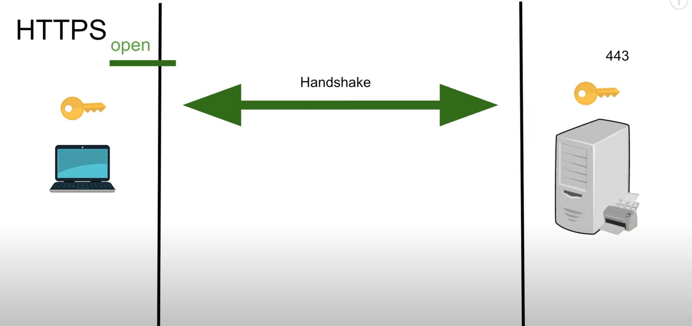
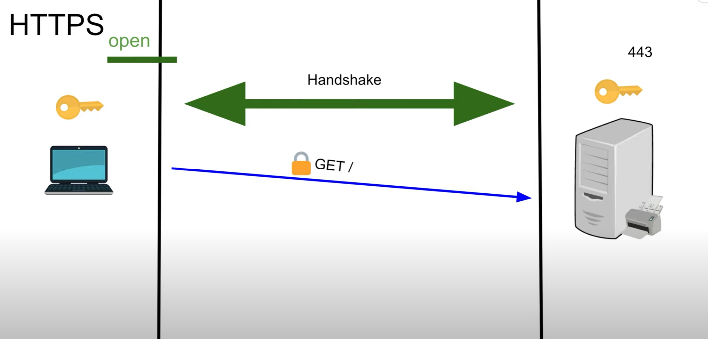
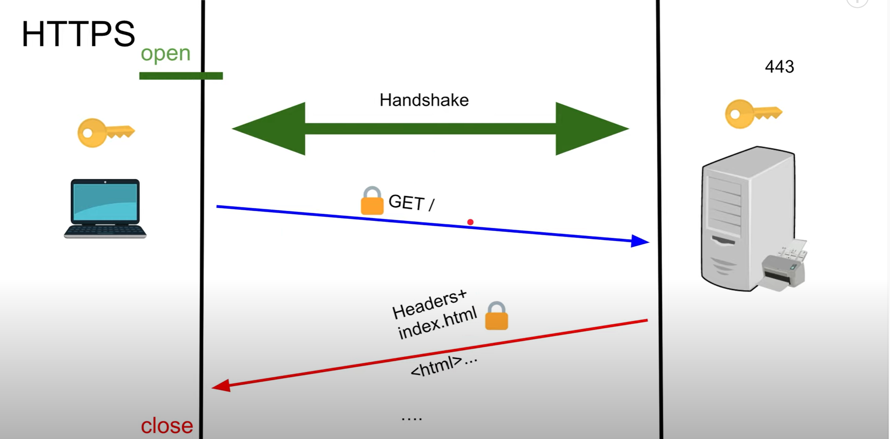
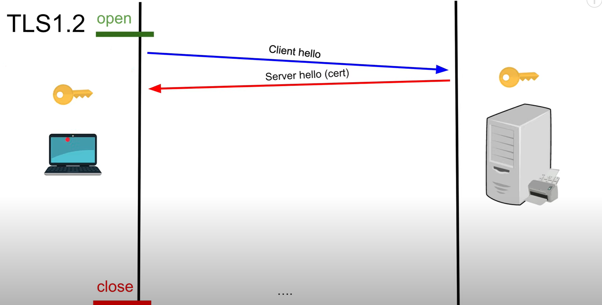
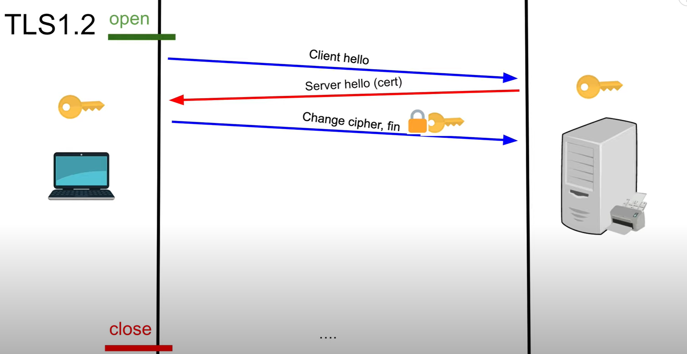
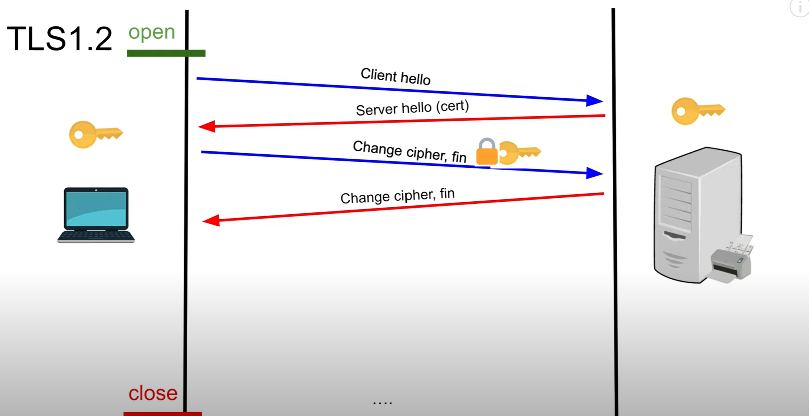
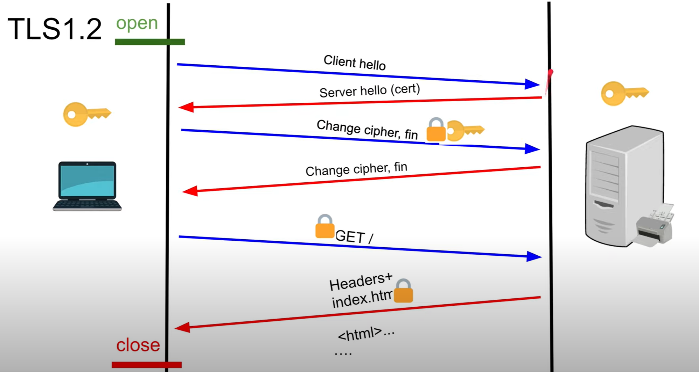

# TLS

## HTTPS

- https://www.youtube.com/watch?v=AlE5X1NlHgg

- We initiate handshake with server before sending GET request
    - Both client and server agree on symmetric key that will be used to encrypt and decrypt traffic
    - Same key on client and server

- Once each one has a key, client will take that key, take the GET request and encrypting it using the key and then tcp transports it to the server

- Server uses its key to decrypt the GET request
    - There is a processing cost associated with decrypting the request
- Server then encrypts the response back to the client and sends it down the tcp pipe

- If someone tries to sniff the packet, they will get garbage
    - If they have the key, they will be able to decrypt the payload
- There is a `KeepAlive` used here so the connection isn't immediately closed

## TLS 1.2

- Client sends `Client hello`
    - Hey server, I'm the client, here's all the ciphers I support
    - Server says okay we'll use the encryption algorithm for key exchange
    - `Server hello` sends server's certificate back to client
        - This is the public key of the server

- The client then uses the certificate it received to encrypt the key that it has

- The client sends its encrypted key to the server
    - `This is really bad`
    - If someone got the private key of the server, then they have access to all the communication

- The client can now encrypt requests and the client can decrypt

 

- So what's the problem with this model?
    - We're encrypting the symmetric key and sending it to the server
    - We're using insecure key exchange
    - openssl had this bug where it allowed people to get the private key of the server

### TLS 1.2 Handshake In Depth

#### Using RSA Key exchange algorithm

1. The `client hello` message:
    - The client initiates the handshake by sending a `hello` message to the server
    - The message will include what TLS version the client supports, the cipher suites supported, and a string of random bytes known as the `client random`

1. The `server hello` message:
    - In reply to the `client hello` message, the server sends:
        - A message containing the server's `SSL certificate`
        - The server's chosen cipher suite
        - The `server random` - a random string of bytes that's generated by the server
1. Authentication
    - The client verifies the server's SSL certificate with the certificate authority that issued it
    - This confirms that the server is who it says it is, and that the client is interacting with the actual owner of the domain
1. The premaster secret
    - The client sends one more random string of bytes, the `premaster secret`
    - The premaster secret is encrypted with the public key of the server and can only be decrypted with the private key by the server
    - The client gets the public key from the server's SSL certificate.
1. Private key used
    - The server decrypts the premaster key
1. Session keys created
    - Both client and server generate session keys from the client random, the server random, and the premaster secret
    - They will get the same key when this is done
1. Client is ready
    - The client sends a `finished` message that is encrypted with a session key
1. Server is ready
    - The server sends a `finished` message encrypted with a session key
1. Secure symmetric encryption achieved
    - The handshake is completed, and communication continues using the session keys